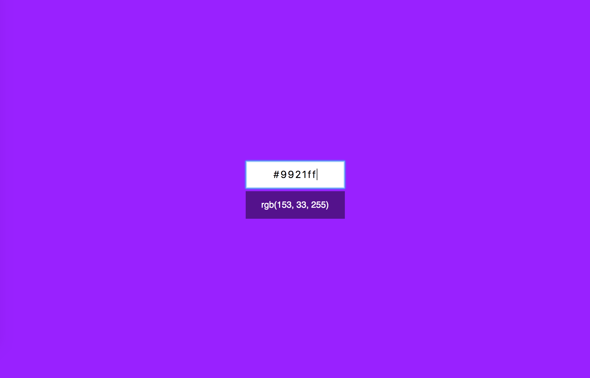
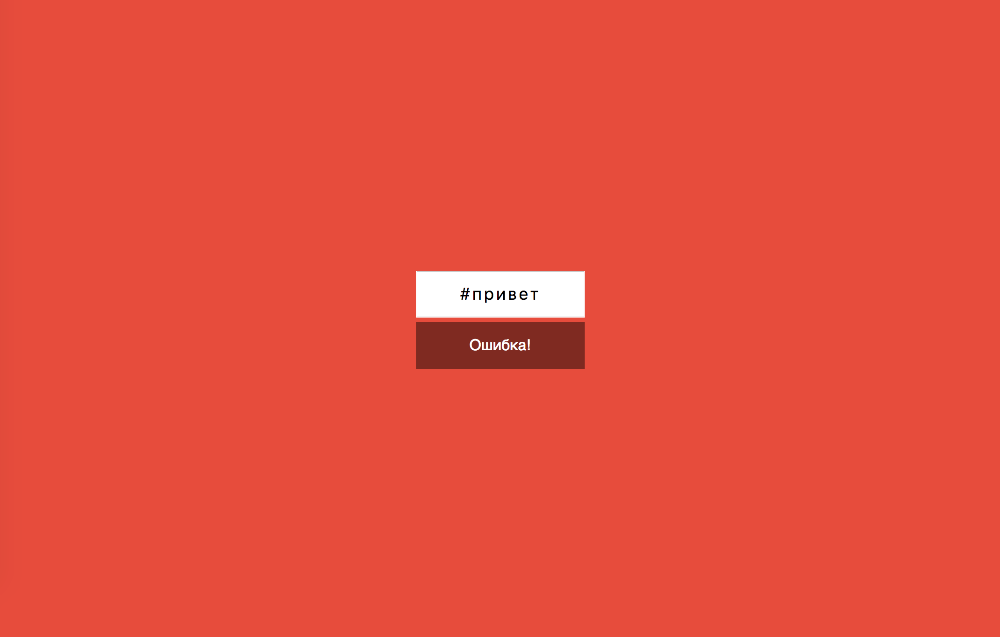

Конвертер цветов из HEX в RGB
===

[](https://github.com/Onemored/ra16-homeworks-forms/actions/workflows/deploy.yml)

Вам необходимо разработать конвертер цветов из HEX в RGB.


## Интерфейс конвертера

При правильном вводе цвета он показывает его представление в формате RGB и меняет цвет фона на заданный:


Конвертер при вводе неправильного цвета в формате HEX должен сообщать об ошибке:


Необходимо дожидаться ввода всех семи символов, включая решётку, чтобы принимать решение о том, показывать ошибку или менять цвет фона.

Стили и пример разметки вы можете найти в папке [markup](./markup). Разметка дана для примера, вы можете реализовать её самостоятельно

## Запуск проекта

Для работы с проектом требуется Node.js 20.19+ и Yarn 1.22.22.

```bash
python3 -m venv .venv
source .venv/bin/activate
yarn install
yarn dev
```

## Проверка и сборка

```bash
yarn lint
yarn test:coverage
yarn build
```

Команда `yarn validate` последовательно запускает линтер, тесты со 100% покрытием и production-сборку.